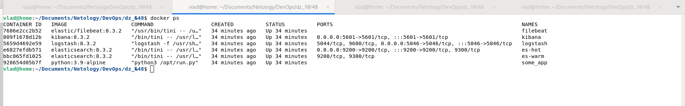
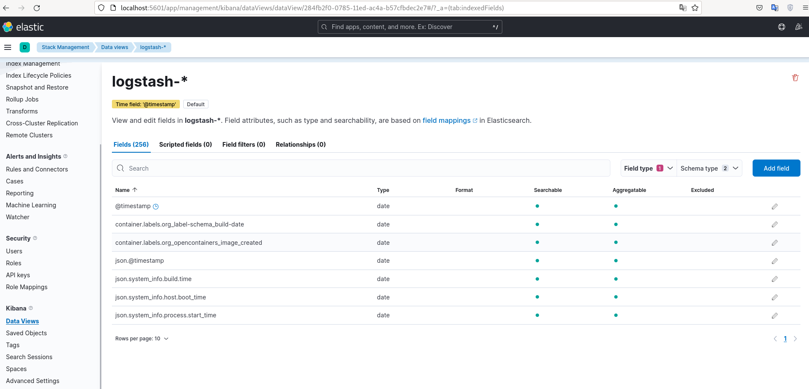
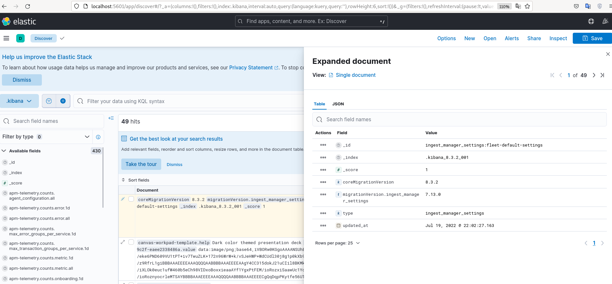
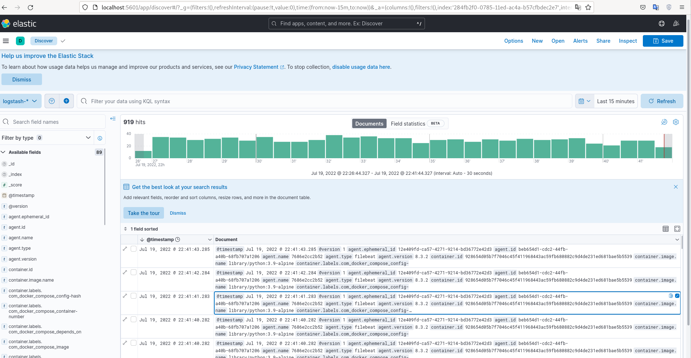

## Задание 1

-  run time docker




-  Kibana



- Приложения были развернуты на послдених доступных версиях в Docker HUB

- - Различия с дирректорией help:

- - - в сервисы es-hot и es-warm добавлено:

``` 
	environment: 
	- xpack.security.enabled=false
```

    
- - - в сервис filebeat добавлено:
```
command:
 filebeat -e --strict.perms=false

``` 
- - - в сервис logstash добавлено:
```
entrypoint: ["logstash", "-f", "/usr/share/logstash/config/logstash.conf"]
```

- Измененная конфигурация logstash:

```
input {
  beats {
    port => 5046
  }
}


output {
  elasticsearch {
    hosts => ["http://es-hot:9200"]
    index => "logstash-%{[@metadata][version]}"
  }
}

```

## Задание 2

-  index Kibana



- Приложение




